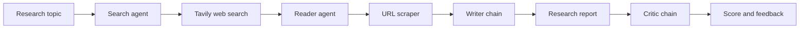

# Multi-Agent Research System

[](https://langchain-multi-agent-research-system.streamlit.app/)
[](LICENSE)

An agentic research assistant that searches the web, extracts useful source content, writes a structured report, and reviews the report for quality. Enter a research topic in the Streamlit interface and follow the progress of each stage from search to critique.

## Live Demo

Try the deployed application: **[Open the Streamlit app](https://langchain-multi-agent-research-system.streamlit.app/)**

## Features

- Web search through Tavily with up to five relevant results.
- Dedicated search and reader agents built with LangChain.
- Multi-strategy article extraction using Trafilatura, Readability, and Beautiful Soup.
- Structured report generation with key findings, a conclusion, and source URLs.
- A critic chain that scores the report and identifies strengths and improvements.
- Streamlit interface with visible pipeline progress and generated output.

## Architecture

The application uses a sequential research pipeline:



1. The **search agent** uses a Groq-hosted model and the Tavily tool to find recent sources.
2. The **reader agent** selects a relevant URL and extracts its readable content.
3. The **writer chain** combines search results and extracted content into a professional report.
4. The **critic chain** reviews the report and returns a score, strengths, improvements, and a verdict.

## Technologies

- **Python 3.11**
- **Streamlit** for the web interface
- **LangChain** and **LangChain Core** for agents, tools, prompts, and chains
- **Groq** via `langchain-groq` for the `openai/gpt-oss-20b` model
- **Tavily** for web search
- **Trafilatura**, **Readability**, **Beautiful Soup**, `requests`, and `lxml` for web extraction
- **python-dotenv** for local environment configuration

## Installation

### 1. Clone the repository

```bash
git clone https://github.com/buildwithsajag/Langchain-multi-agent-research-system.git
cd Langchain-multi-agent-research-system
```

### 2. Create an environment

Using Conda:

```bash
conda create -n langagent python=3.11
conda activate langagent
pip install -r requirements.txt
```

Or using a standard Python virtual environment:

```bash
python3.11 -m venv .venv
source .venv/bin/activate
python -m pip install -r requirements.txt
```

### 3. Configure API keys

Create a `.env` file in the repository root:

```dotenv
GROQ_API_KEY=your_groq_api_key
TAVILY_API_KEY=your_tavily_api_key
```

Get credentials from [Groq](https://console.groq.com/keys) and [Tavily](https://app.tavily.com/). Never commit `.env` files or expose API keys in source control.

## Usage

Start the Streamlit application from the repository root:

```bash
streamlit run app.py
```

Then open the local URL shown by Streamlit, usually `http://localhost:8501`.

For a command-line pipeline run, use:

```bash
python main.py
```

## Project Structure

```text
.
├── app.py                  # Streamlit entry point
├── main.py                 # Command-line pipeline example
├── requirements.txt        # Python dependencies
└── src/
	├── agents/             # Search and reader agents plus LLM chains
	├── pipelines/          # Sequential research workflow
	└── tools/              # Tavily search and web scraping tools
```

## Notes

- The application makes external API calls and requires valid Groq and Tavily keys.
- Search results and extracted content depend on third-party services and website availability.
- Generated reports should be checked against the linked sources before being used for high-stakes decisions.

## License

This project is licensed under the [Apache License 2.0](LICENSE).